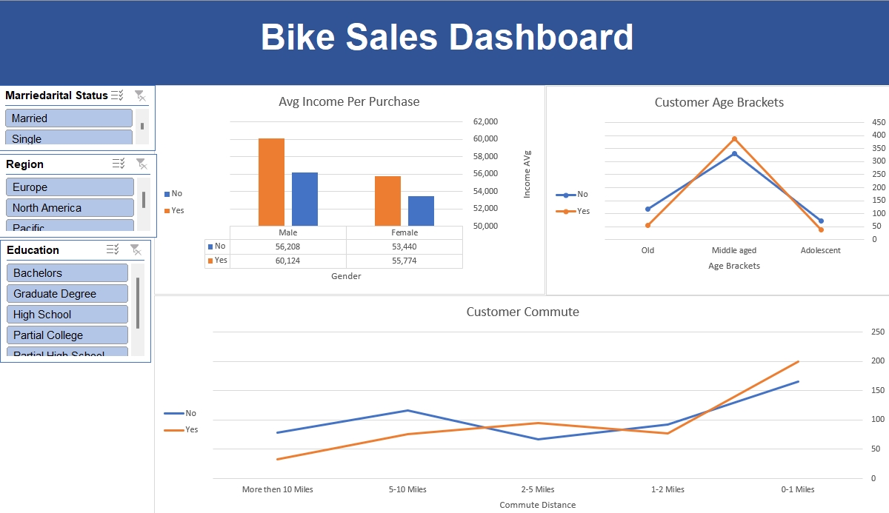

# Data Analysis Projects Portfolio

  

## Introduction
Welcome to my data analysis projects portfolio, showcasing practical skills developed during the AlexTheAnalyst Bootcamp. This repository features projects utilizing Excel, SQL, Python, Power BI, and Tableau, demonstrating a full data analysis lifecycle from acquisition and cleaning to exploration, visualization, and insight extraction.

## Projects Overview

### 1. Nashville Housing Data Cleaning (SQL)
This project demonstrates essential data cleaning and transformation techniques using SQL to prepare raw housing data for accurate analysis.

**Tools:** SQL (MySQL/SQL Server syntax)

### 2. COVID-19 Data Exploration (SQL)
In-depth exploration of global COVID-19 data to analyze infection rates, death percentages, and vaccination progress using advanced SQL queries.

**Tools:** SQL (Joins, CTEs, Window Functions)

### 3. Bike Sales Analysis (Excel)
This project focuses on analyzing customer demographics and purchasing behavior using Excel. It demonstrates data manipulation and interactive dashboard creation.

**Tools:** Microsoft Excel

### 4. Airbnb Listings Analysis (Tableau)
Analyzes Airbnb listing data for Seattle, focusing on pricing, revenue, and geographical distribution, presented through an interactive Tableau dashboard.

**Tools:** Tableau

### 5. Data Professional Survey Breakdown (Power BI)
Analysis of a global survey of data professionals, revealing trends in salaries, job satisfaction, and career paths. Presented via an interactive Power BI dashboard.

**Tools:** Power BI, DAX

### 6. Amazon Web Scraping (Python)
Programmatically collects product information from Amazon for price tracking or competitive analysis using Python web scraping techniques.

**Tools:** Python (BeautifulSoup, Requests, Pandas, Smtplib)

### 7. Crypto API Automation & Visualization (Python)
Fetches real-time cryptocurrency data from an API and visualizes key trends using Python libraries.

**Tools:** Python (Requests, Pandas, Seaborn, Matplotlib)

## Skills Demonstrated
-   **Data Cleaning & Transformation:** SQL, Excel
-   **Data Exploration & Analysis:** SQL, Python, Excel
-   **Data Visualization & Reporting:** Power BI, Tableau, Excel, Python (Matplotlib, Seaborn)
-   **Data Acquisition:** Python Web Scraping, API Integration
-   **Programming Languages:** Python, SQL

## Technologies Used

| Category            | Technologies & Tools                                   |
| :------------------ | :----------------------------------------------------- |
| **Programming**     | Python, SQL                                            |
| **Data Analysis**   | Microsoft Excel, Pandas (Python)                       |
| **Data Cleaning**   | SQL, Excel                                             |
| **Data Visualization** | Power BI, Tableau, Matplotlib (Python), Seaborn (Python), Excel |
| **Web Scraping**    | BeautifulSoup (Python), Requests (Python)              |
| **API Integration** | Requests (Python)                                      |

## Contact
-   **GitHub:** [ GitHub Profile](https://github.com/EsamAdelAlselwi)
-   **LinkedIn:** [LinkedIn Profile](https://www.linkedin.com/in/esam-al-selwi-866077374)
-   **Email:** [ Email Address](mailto:esamalselwi404@gmail.com)
